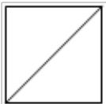
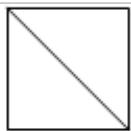
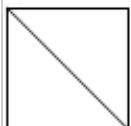

<!-- question-source:start -->
6. (5 分) 一个正方体被一个平面截去一部分后, 剩余部分的三视图如图, 则截去
部分体积与剩余部分体积的比值为（）

A. $\frac{1}{8}$ B. $\frac{1}{7}$ C. $\frac{1}{6}$ D. $\frac{1}{5}$
<!-- question-source:end -->

![[高中/真题/按年份分类/2015/2015年全国统一高考数学试卷_文科__新课标ⅱ__含解析版_/选择题/题目/answers/Q00025214A1.md]]
