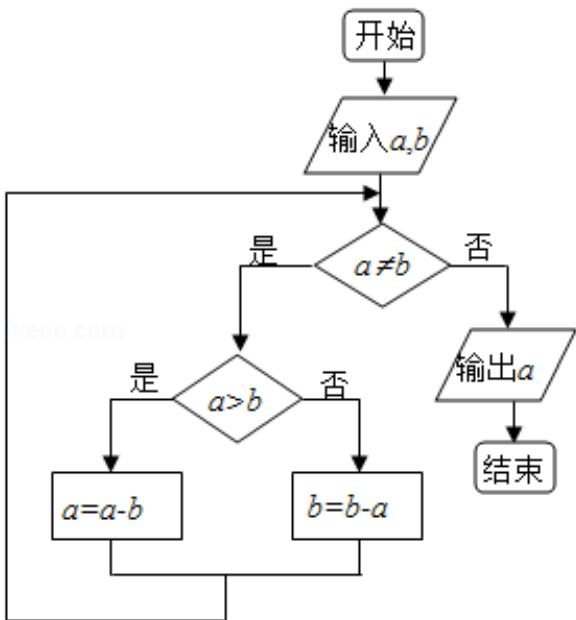

<!-- question-source:start -->
8. (5 分) 如图程序框图的算法思路源于我国古代数学名著《九章算术》中的“更相减损术”. 执行该程序框图, 若输入 $a, b$ 分别为 14, 18, 则输出的 $a = (\quad)$

A. 0 B. 2 C. 4 D. 14
<!-- question-source:end -->

![[高中/真题/按年份分类/2015/2015年全国统一高考数学试卷_文科__新课标ⅱ__含解析版_/选择题/题目/answers/Q00025216A1.md]]
