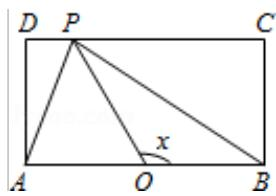
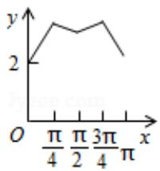
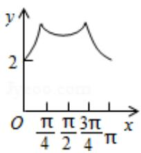
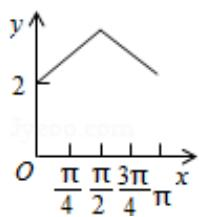
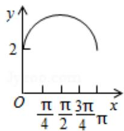

<!-- question-source:start -->
11. （5 分）如图，长方形 ABCD 的边 AB=2，BC=1，O 是 AB 的中点，点 P 沿着边 BC, CD 与 DA 运动，记 $\angle BOP=x$ . 将动点 P 到 A, B 两点距离之和表示为 x 的函数

f（x），则 y=f（x）的图象大致为（）

A.  

B.

C.

D.
<!-- question-source:end -->

![[高中/真题/按年份分类/2015/2015年全国统一高考数学试卷_文科__新课标ⅱ__含解析版_/选择题/题目/answers/Q00025219A1.md]]
