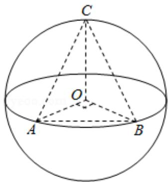

> [!faq]- 2015年全国统一高考数学试卷（文科）（新课标ⅱ）（含解析版）解析
>
> > [!success]- **【答案】** C
>
> > [!note]- **【分析】**
> > 当点 C 位于垂直于面 AOB 的直径端点时，三棱锥 O-ABC 的体积最大，利
>
> > [!note]- **【解析】**
> > 解：如图所示，当点 C 位于垂直于面 AOB 的直径端点时，三棱锥 O-ABC
> >
> > 的体积最大，设球 O 的半径为 R，此时 $V_{O-ABC}=V_{C-AOB}=\frac{1}{3}\times\frac{1}{2}\times R^{2}\times R=\frac{1}{6}R^{3}$
> >
> > =36，故 R=6，则球 O 的表面积为 $4\pi R^{2}=144\pi$ ，
> >
> > 故选：C.
> >
> > 
> >
> > 【点评】本题考查球的半径与表面积，考查体积的计算，确定点 C 位于垂直于面
> > AOB 的直径端点时，三棱锥 O-ABC 的体积最大是关键.
