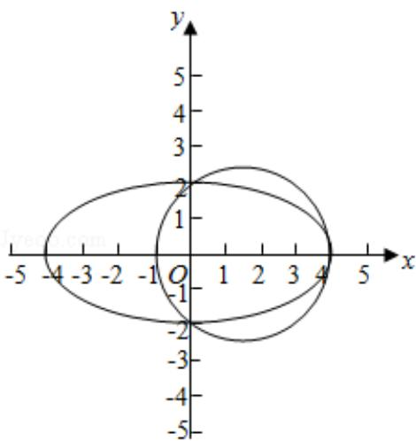

> [!faq]- 2015年全国统一高考数学试卷（理科）（新课标ⅰ）（含解析版）解析
>
> > [!success]- **【答案】** 为： $\left(x-\frac{3}{2}\right)^{2}+y^{2}=\frac{25}{4}$  【点评】本题考查椭圆的简单性质的应用，圆的方程的求法，考查计算能力.
>
> > [!note]- **【分析】**
> > 利用椭圆的方程求出顶点坐标, 然后求出圆心坐标, 求出半径即可得到圆
>
> > [!note]- **【解析】**
> > 分析】利用椭圆的方程求出顶点坐标, 然后求出圆心坐标, 求出半径即可得到圆
> >
> > 的方程.
> >
> > 【
> > 解答】解：一个圆经过椭圆 $\frac{x^2}{16} +\frac{y^2}{4} = 1$ 的三个顶点．且圆心在 $x$ 轴的正半轴上.
> >
> > 可知椭圆的右顶点坐标（4，0），上下顶点坐标（0，±2）
> >
> > 设圆的圆心（a，0），则 $\sqrt{(a - 0)^2 + (0 - 2)^2} = 4 - a$ ，解得 $a = \frac{3}{2}$
> >
> > 圆的半径为： $\frac{5}{2}$
> >
> > 所求圆的方程为： $(x - \frac{3}{2})^2 + y^2 = \frac{25}{4}$
> >
> > 故
> > 答案为： $\left(x-\frac{3}{2}\right)^{2}+y^{2}=\frac{25}{4}$
> >
> > 
> >
> > 【点评】本题考查椭圆的简单性质的应用，圆的方程的求法，考查计算能力.
