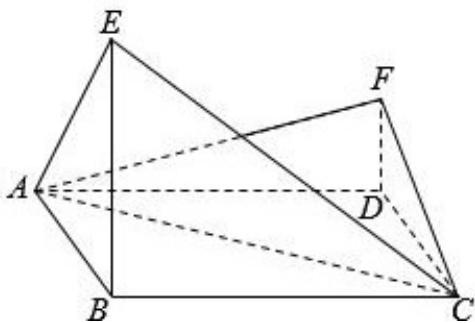

<!-- question-source:start -->
18. (12 分) 如图, 四边形 ABCD 为菱形, $\angle ABC = 120^{\circ}$ , E, F 是平面 ABCD 同一侧的

两点，BE ⊥ 平面 ABCD，DF ⊥ 平面 ABCD，BE = 2DF，AE ⊥ EC.

（Ⅰ）证明：平面 AEC ⊥ 平面 AFC

（Ⅱ）求直线 AE 与直线 CF 所成角的余弦值.

<!-- question-source:end -->

![[高中/真题/按年份分类/2015/2015年全国统一高考数学试卷_理科__新课标ⅰ__含解析版_/解答题/题目/answers/Q00024471A1.md]]
