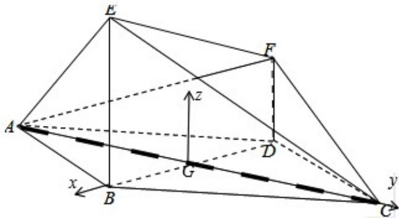

> [!faq]- 2015年全国统一高考数学试卷（理科）（新课标ⅰ）（含解析版）解析
>
> > [!success]- **【答案】** 详见解析
>
> > [!note]- **【分析】**
> > （Ⅰ）连接 BD，设 $BD \cap AC = G$ ，连接 EG、EF、FG，运用线面垂直的判定定理得
>
> > [!note]- **【解析】**
> > 分析】（Ⅰ）连接 BD，设 $BD \cap AC = G$ ，连接 EG、EF、FG，运用线面垂直的判定定理得
> >
> > 到 EG⊥平面 AFC，再由面面垂直的判定定理，即可得到；
> >
> > （Ⅱ）以 G 为坐标原点，分别以 GB，GC 为 x 轴，y 轴，|GB| 为单位长度，建立空间
> >
> > 直角坐标系 G-xyz，求得 A, E, F, C 的坐标，运用向量的数量积的定义，计算即
> >
> > 可得到所求角的余弦值.
> >
> > 【
> > 解答】解：（Ⅰ）连接 BD，
> >
> > 设 BD∩AC=G，
> >
> > 连接 EG、EF、FG，
> >
> > 在菱形 ABCD 中，
> >
> > 不妨设 BG=1，
> >
> > 由 $\angle ABC=120^{\circ}$ ,
> >
> > 可得 AG=GC= $\sqrt{3}$ ,
> >
> > BE⊥平面 ABCD，AB=BC=2，
> >
> > 可知 AE=EC，又 AE⊥EC，
> >
> > 所以 $EG=\sqrt{3}$ ，且 $EG\perp AC$ ，
> >
> > 在直角 $\triangle EBG$ 中，可得 $BE = \sqrt{2}$ ，故 $DF = \frac{\sqrt{2}}{2}$ ，
> >
> > 在直角三角形 FDG 中，可得 $FG=\frac{\sqrt{6}}{2}$ ,
> >
> > 在直角梯形BDFE中，由 $BD = 2$ ， $\mathrm{BE} = \sqrt{2}$ ， $\mathrm{FD} = \frac{\sqrt{2}}{2}$ ，可得 $\mathrm{EF} = \sqrt{2^2 + (\sqrt{2} - \frac{\sqrt{2}}{2})^2} = \frac{3\sqrt{2}}{2}$
> >
> > 从而 $EG^{2}+FG^{2}=EF^{2}$ ，则 $EG \perp FG$ ，
> >
> > (或由 $\tan\angle EGB\cdot\tan\angle FGD=\frac{EB}{BG}\cdot\frac{FD}{DG}=\sqrt{2}\cdot\frac{\sqrt{2}}{2}=1$ ,
> >
> > 可得 $\angle EGB + \angle FGD = 90^{\circ}$ ，则 $EG\bot FG)$
> >
> > AC∩FG=G，可得 EG⊥平面 AFC，
> >
> > 由 EGC 平面 AEC，所以平面 AEC⊥平面 AFC；
> >
> > （II）如图，以 G 为坐标原点，分别以 GB，GC 为 x 轴，y 轴，|GB| 为单位长度，
> >
> > 建立空间直角坐标系 G - xyz，由（Ⅰ）可得 A（0， $-\sqrt{3}$ ，0），E（1，0， $\sqrt{2}$ ），
> >
> > $$
> > F (- 1, 0, \frac {\sqrt {2}}{2}), C (0, \sqrt {3}, 0)
> > $$
> >
> > 即有 $\overrightarrow{\mathrm{AE}} = (1, \sqrt{3}, \sqrt{2})$ ， $\overrightarrow{\mathrm{CF}} = (-1, -\sqrt{3}, \frac{\sqrt{2}}{2})$ ，
> >
> > 故 $\cos < \overrightarrow{\mathrm{AE}}$ ， $\overrightarrow{\mathrm{CF}} > = \frac{\overrightarrow{\mathrm{AE}}\cdot\overrightarrow{\mathrm{CF}}}{|\overrightarrow{\mathrm{AE}}|*\overrightarrow{\mathrm{CF}}|} = \frac{-1 - 3 + 1}{\sqrt{6}\times\sqrt{\frac{9}{2}}} = -\frac{\sqrt{3}}{3}.$
> >
> > 则有直线 AE 与直线 CF 所成角的余弦值为 $\frac{\sqrt{3}}{3}$ .
> >
> > 
> >
> > 【点评】本题考查空间直线和平面的位置关系和空间角的求法，主要考查面面垂直的判定定理和异面直线所成的角的求法：向量法，考查运算能力，属于中档题.
