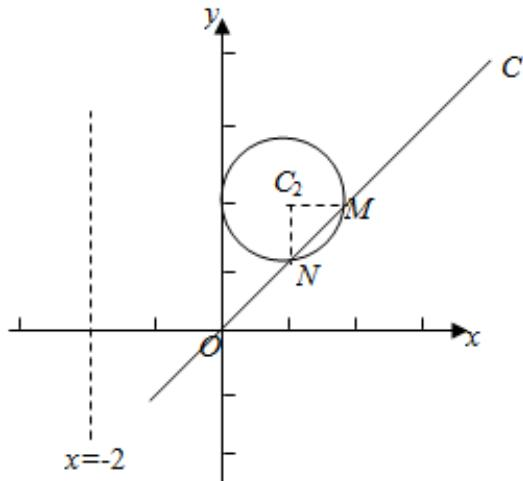

> [!faq]- 2015年全国统一高考数学试卷（理科）（新课标ⅰ）（含解析版）解析
>
> > [!success]- **【答案】** 详见解析
>
> > [!note]- **【分析】**
> > （Ⅰ）由条件根据 $x=\rho\cos\theta$ ， $y=\rho\sin\theta$ 求得 $C_{1}$ ， $C_{2}$ 的极坐标方程.
>
> > [!note]- **【解析】**
> > 解：（Ⅰ）由于 $x=\rho\cos\theta,\quad y=\rho\sin\theta,\quad \therefore C_{1}:x=-2$ 的
> >
> > 极坐标方程为 $\rho\cos\theta=-2$ ，
> >
> > 故 $C_{2}$ : $(x-1)^{2}+(y-2)^{2}=1$ 的极坐标方程为:
> >
> > $$
> > (\rho \cos \theta - 1) ^ {2} + (\rho \sin \theta - 2) ^ {2} = 1,
> > $$
> >
> > 化简可得 $\rho^{2}-\left(2\rho\cos\theta+4\rho\sin\theta\right)+4=0$ .
> >
> > （II）把直线 $C_3$ 的极坐标方程 $\theta = \frac{\pi}{4}$ （ $\rho \in R$ ）代入
> >
> > $$
> > (x - 1) ^ {2} + (y - 2) ^ {2} = 1
> > $$
> >
> > 可得 $\rho^{2}-\left(2\rho\cos\theta+4\rho\sin\theta\right)+4=0$
> >
> > 求得 $\rho_{1}=2\sqrt{2}$ ， $\rho_{2}=\sqrt{2}$ ，
> >
> > $\therefore \left|MN\right| = \left|\rho_{1} - \rho_{2}\right| = \sqrt{2}$ ，由于圆 $C_2$ 的半径为 1， $\therefore C_2M \perp C_2N$ ，
> >
> > $\triangle C_{2}MN$ 的面积为 $\frac{1}{2} \cdot C_{2}M \cdot C_{2}N = \frac{1}{2} \cdot 1 \cdot 1 = \frac{1}{2}$ .
> >
> > 
> >
> > 【点评】本题主要考查简单曲线的极坐标方程，点的极坐标的定义，属于基础题.
> >
> > 选修4—5：不等式选讲
