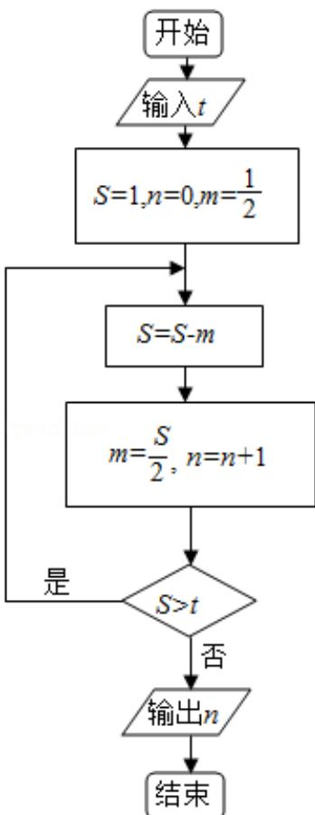

<!-- question-source:start -->
9. （5分）执行如图所示的程序框图，如果输入的 $t = 0.01$ ，则输出的 $n =$ （

A. 5 B. 6 C. 7 D. 8
<!-- question-source:end -->

![[高中/真题/按年份分类/2015/2015年全国统一高考数学试卷_理科__新课标ⅰ__含解析版_/选择题/题目/answers/Q00024462A1.md]]
