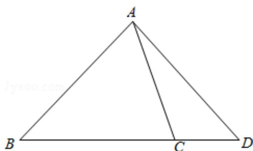

> [!faq]- 2015年全国统一高考数学试卷（理科）（新课标ⅰ）（含解析版）解析
>
> > [!success]- **【答案】** A
>
> > [!note]- **【分析】**
> > 将向量 $\overrightarrow{AD}$ 利用向量的三角形法则首先表示为 $\overrightarrow{AB} +\overrightarrow{BD}$ ，然后结合已知表示为 $\overrightarrow{AB}$ ， $\overrightarrow{AC}$ 的形式.
>
> > [!note]- **【解析】**
> > 分析】将向量 $\overrightarrow{AD}$ 利用向量的三角形法则首先表示为 $\overrightarrow{AB} +\overrightarrow{BD}$ ，然后结合已知表示为 $\overrightarrow{AB}$ ， $\overrightarrow{AC}$ 的形式.
> >
> > 【
> > 解答】解：由已知得到如图
> >
> > $$
> > \overrightarrow {A D} = \overrightarrow {A B} + \overrightarrow {B D} = \overrightarrow {A B} + \frac {4}{3} \overrightarrow {B C} = \overrightarrow {A B} + \frac {4}{3} (\overrightarrow {A C} - \overrightarrow {A B}) = - \frac {1}{3} \overrightarrow {A B} + \frac {4}{3} \overrightarrow {A C};
> > $$
> >
> > 故选：A.
> >
> > 
> >
> > 【点评】本题考查了向量的三角形法则的运用；关键是想法将向量 $\overrightarrow{\mathrm{AD}}$ 表示为
> >
> > $$
> > \overrightarrow {A B}, \overrightarrow {A C}.
> > $$
