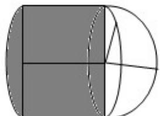

> [!faq]- 2015年全国统一高考数学试卷（理科）（新课标ⅰ）（含解析版）解析
>
> > [!success]- **【答案】** B
>
> > [!note]- **【分析】**
> > 通过三视图可知该几何体是一个半球拼接半个圆柱，计算即可.
>
> > [!note]- **【解析】**
> > 解：由几何体三视图中的正视图和俯视图可知，
> >
> > 截圆柱的平面过圆柱的轴线，
> >
> > 该几何体是一个半球拼接半个圆柱，
> >
> > ∴其表面积为： $\frac{1}{2}\times4\pi r^{2}+\frac{1}{2}\times\pi r^{2}+\frac{1}{2}\times2r\times2\pi r+2r\times2r+\frac{1}{2}\times\pi r^{2}=5\pi r^{2}+4r^{2}$
> >
> > 又∵该几何体的表面积为 $16+20\pi$ ,
> >
> > $\therefore 5 \pi r^{2} + 4r^{2} = 16 + 20\pi$ ，解得 $r = 2$
> >
> > 故选：B.
> >
> > 
> >
> > 【点评】本题考查由三视图求表面积问题,考查空间想象能力,注意解题方法的积
> >
> > 累，属于中档题.
