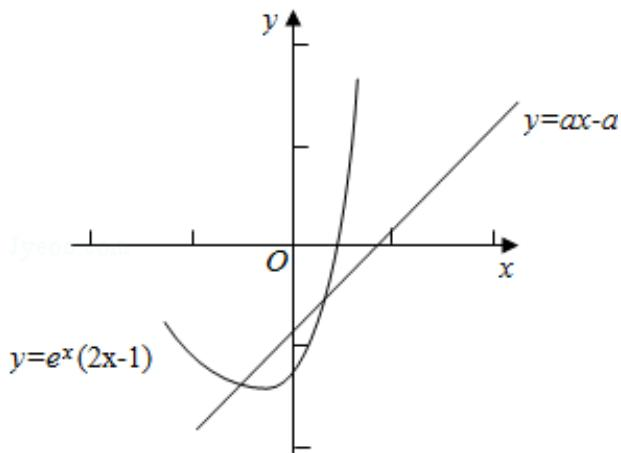

> [!faq]- 2015年全国统一高考数学试卷（理科）（新课标ⅰ）（含解析版）解析
>
> > [!success]- **【答案】** D
>
> > [!note]- **【分析】**
> > 设 $g(x)=e^{x}(2x-1)$ ，y=ax-a，问题转化为存在唯一的整数 $x_{0}$ 使得 $g(x_{0})$ 在
>
> > [!note]- **【解析】**
> > 解：设 $g(x) = e^{x}(2x - 1)$ ，y = ax - a，
> >
> > 由题意知存在唯一的整数 $x_{0}$ 使得 g ( $x_{0}$ ) 在直线 y=ax-a 的下方，
> >
> > $$
> > \because \mathrm{g} ^ {\prime} (\mathrm{x}) = \mathrm{e} ^ {\mathrm{x}} (2 \mathrm{x} - 1) + 2 \mathrm{e} ^ {\mathrm{x}} = \mathrm{e} ^ {\mathrm{x}} (2 \mathrm{x} + 1),
> > $$
> >
> > ∴当 $x < -\frac{1}{2}$ 时， $g'(x) < 0$ ，当 $x > -\frac{1}{2}$ 时， $g'(x) > 0$ ，
> >
> > ∴当 $x = -\frac{1}{2}$ 时，g（x）取最小值 $-2_{e}^{-\frac{1}{2}}$
> >
> > 当 x=0 时，g（0）=-1，当 x=1 时，g（1）=e>0，
> >
> > 直线 y=ax-a 恒过定点（1，0）且斜率为 a，
> >
> > 故 $-a > g(0) = -1$ 且 $g(-1) = -3e^{-1} \geq -a - a$ ，解得 $\frac{3}{2e} \leqslant a < 1$
> >
> > 故选：D.
> >
> > 
> >
> > 【点评】本题考查导数和极值，涉及数形结合和转化的思想，属中档题.
> >
> > ##
> > 二、填空题（本大题共有4小题，每小题5分）
