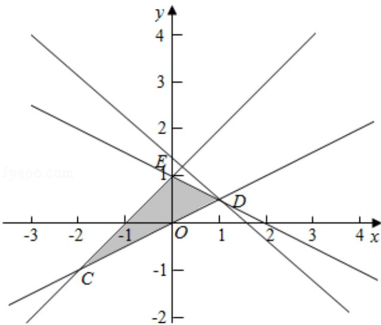

> [!faq]- 2015年全国统一高考数学试卷（理科）（新课标ⅱ）（含解析版）解析
>
> > [!success]- **【答案】** $\frac{3}{2}$
>
> > [!note]- **【分析】**
> > 首先画出平面区域, 然后将目标函数变形为直线的斜截式, 求在 y 轴的截
>
> > [!note]- **【解析】**
> > 解: 不等式组表示的平面区域如图阴影部分, 当直线经过 D 点时, z 最大,
> > 由 $\left\{\begin{aligned}x-2y&=0\\ x+2y&=2=0\end{aligned}\right.$ 得D $(1,\frac{1}{2})$ ,
> > 所以 $z=x+y$ 的最大值为 $1+\frac{1}{2}=\frac{3}{2}$ ;
> >
> > 
> >
> > 故答案为： $\frac{3}{2}$ .
> >
> > 【点评】本题考查了简单线性规划；一般步骤是：①画出平面区域；②分析目标函
> >
> > 数，确定求最值的条件.
