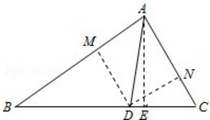

> [!faq]- 2015年全国统一高考数学试卷（理科）（新课标ⅱ）（含解析版）解析
>
> > [!success]- **【答案】** (12 分) $\triangle ABC$ 中, $D$ 是 $BC$ 上的点, $AD$ 平分 $\angle BAC$ , $\triangle ABD$ 面积是 $\triangle ADC$ 面积的
>
> > [!note]- **【分析】**
> > (1) 如图, 过 A 作 AE⊥BC 于 E, 由已知及面积公式可得 BD=2DC, 由 AD 平分∠BAC 及正弦定理可得 $\sin\angle B=\frac{AD\times\sin\angle BAD}{BD}$ , $\sin\angle C=\frac{AD\times\sin\angle DAC}{DC}$ , 从而得解 $\frac{\sin\angle B}{\sin\angle C}$ .
> > (2) 由
> > (1) 可求 $BD = \sqrt{2}$ . 过 D 作 $DM \perp AB$ 于 M, 作 $DN \perp AC$ 于 N, 由 AD 平分 $\angle BAC$ , 可求 $AB = 2AC$ , 令 $AC = x$ , 则 $AB = 2x$ , 利用余弦定理即可解得 BD 和 AC 的长.
>
> > [!note]- **【解析】**
> > 解：
> > （1）如图，过A作AE⊥BC于E，
> >
> > $$
> > \therefore \frac {S _ {\triangle A B D}}{S _ {\triangle A D C}} = \frac {\frac {1}{2} B D \times A E}{\frac {1}{2} D C \times A E} = 2
> > $$
> >
> > $\therefore BD=2DC,$
> >
> > ∵AD 平分∠BAC
> >
> > $\therefore \angle BAD = \angle DAC$
> >
> > 在 $\triangle ABD$ 中， $\frac{BD}{\sin\angle BAD}=\frac{AD}{\sin\angle B}$ ， $\therefore\sin\angle B=\frac{AD\times\sin\angle BAD}{BD}$
> >
> > 在 $\triangle ADC$ 中， $\frac{DC}{\sin\angle DAC}=\frac{AD}{\sin\angle C}$ ， $\therefore\sin\angle C=\frac{AD\times\sin\angle DAC}{DC}$ ；
> >
> > $\therefore\frac{\sin\angle B}{\sin\angle C}=\frac{DC}{BD}=\frac{1}{2}.\cdots6$ 分
> > (2) 由
> > (1) 知, $\mathrm{BD} = 2\mathrm{DC} = 2 \times \frac{\sqrt{2}}{2} = \sqrt{2}$ .
> >
> > 过 D 作 DM⊥AB 于 M，作 DN⊥AC 于 N，
> >
> > ∵AD 平分∠BAC，
> >
> > $\therefore DM=DN,$
> >
> > $$
> > \therefore \frac {S _ {\triangle A B D}}{S _ {\triangle A D C}} = \frac {\frac {1}{2} A B \times D M}{\frac {1}{2} A C \times D N} = 2,
> > $$
> >
> > $$
> > \therefore A B = 2 A C,
> > $$
> >
> > 令 AC=x，则 AB=2x，
> >
> > $$
> > \because \angle B A D = \angle D A C,
> > $$
> >
> > $\therefore \cos \angle BAD = \cos \angle DAC,$
> >
> > ∴由余弦定理可得： $\frac{(2x)^{2}+1^{2}-(\sqrt{2})^{2}}{2\times2x\times1}=\frac{x^{2}+1^{2}-(\frac{\sqrt{2}}{2})^{2}}{2\times x\times1}$
> >
> > $\therefore x=1,$
> >
> > $\therefore AC=1,$
> >
> > $\therefore BD$ 的长为 $\sqrt{2}$ , AC 的长为 1.
> >
> > 
