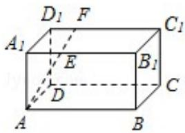

<!-- question-source:start -->
19. (12 分) 如图, 长方体 $ABCD - A_{1}B_{1}C_{1}D_{1}$ 中, $AB = 16$ , $BC = 10$ , $AA_{1} = 8$ , 点 $E$ , $F$ 分别

在 $A_{1}B_{1}$ ， $D_{1}C_{1}$ 上， $A_{1}E=D_{1}F=4$ ，过点 E，F 的平面 $\alpha$ 与此长方体的面相交，交线围

成一个正方形.

(1) 在图中画出这个正方形（不必说明画法和理由）；

(2) 求直线 AF 与平面 $\alpha$ 所成角的正弦值.

<!-- question-source:end -->

![[高中/真题/按年份分类/2015/2015年全国统一高考数学试卷_理科__新课标ⅱ__含解析版_/解答题/题目/answers/Q00027155A1.md]]
