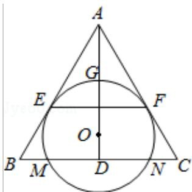

<!-- question-source:start -->
22. （10 分）如图，O 为等腰三角形 ABC 内一点， $\odot O$ 与 $\triangle ABC$ 的底边 BC 交于 M，N 两点，与底边上的高 AD 交于点 G，且与 AB，AC 分别相切于 E，F 两点.

(1) 证明: EF∥BC;

(2) 若 AG 等于 $\odot O$ 的半径，且 $AE=MN=2\sqrt{3}$ ，求四边形 EBCF 的面积.

## 选修 4-4：坐标系与参数方程
<!-- question-source:end -->

![[高中/真题/按年份分类/2015/2015年全国统一高考数学试卷_理科__新课标ⅱ__含解析版_/解答题/题目/answers/Q00027158A1.md]]
