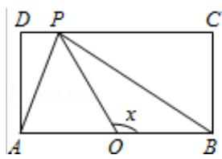
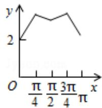
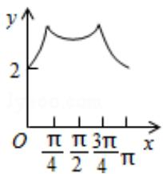
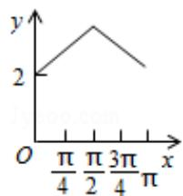
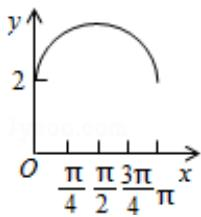

<!-- question-source:start -->
11. BC, CD 与 DA 运动, 记 $\angle BOP = x$ . 将动点 P 到 A, B 两点距离之和表示为 x 的函

数 $f(x)$ ，则 $y = f(x)$ 的图象大致为（）

A.

B.

C.

D.

【考点】HC：正切函数的图象.

【
<!-- question-source:end -->

![[高中/真题/按年份分类/2015/2015年全国统一高考数学试卷_理科__新课标ⅱ__含解析版_/解答题/题目/answers/Q00027161A1.md]]
