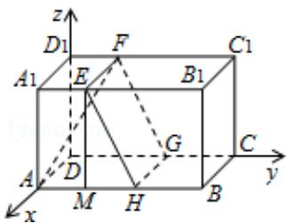

> [!faq]- 2015年全国统一高考数学试卷（理科）（新课标ⅱ）（含解析版）解析
>
> > [!success]- **【答案】** 详见解析
>
> > [!note]- **【分析】**
> > （1）容易知道所围成正方形的边长为 10，再结合长方体各边的长度，即
>
> > [!note]- **【解析】**
> > 分析】（1）容易知道所围成正方形的边长为 10，再结合长方体各边的长度，即
> >
> > 可找出正方形的位置，从而画出这个正方形；
> >
> > (2) 分别以直线 DA, DC, $DD_{1}$ 为 x, y, z 轴, 建立空间直角坐标系, 考虑用空间向量
> >
> > 解决本问，能够确定 A，H，E，F 几点的坐标．设平面 EFGH 的法向量为
> >
> > $\vec{\mathrm{n}} = (\mathrm{x}, \mathrm{y}, \mathrm{z})$ ，根据 $\left\{ \begin{array}{l} \vec{\mathrm{n}} \cdot \overrightarrow{\mathrm{EH}} = 0 \\ \vec{\mathrm{n}} \cdot \overrightarrow{\mathrm{EF}} = 0 \end{array} \right.$ 即可求出法向量 $\vec{\mathrm{n}}$ ， $\overrightarrow{\mathrm{AF}}$ 坐标可以求出，可设直线
> >
> > AF与平面EFGH所成角为 $\theta$ ，由 $\sin \theta = |\cos < n, \overrightarrow{AF} >|$ 即可求得直线AF与平
> >
> > 面 $\alpha$ 所成角的正弦值.
> >
> > 【
> > 解答】解：（1）交线围成的正方形 EFGH 如图：
> >
> > (2) 作 EM⊥AB，垂足为 M，则：
> >
> > EH=EF=BC=10, EM=AA $_{1}$ =8;
> >
> > $\therefore \mathrm{MH} = \sqrt{\mathrm{EH}^2 - \mathrm{EM}^2} = 6, \therefore \mathrm{AH} = 10;$
> >
> > 以边 DA，DC， $DD_{1}$ 所在直线为 x，y，z 轴，建立如图所示空间直角坐标系，则：
> >
> > A (10, 0, 0), H (10, 10, 0), E (10, 4, 8), F (0, 4, 8);
> >
> > $$
> > \therefore \overrightarrow {E F} = (- 1 0, 0, 0), \overrightarrow {E H} = (0, 6, - 8);
> > $$
> >
> > 设 $\vec{\mathbf{n}} = (\mathbf{x},\mathbf{y},\mathbf{z})$ 为平面EFGH的法向量，则：
> >
> > $\left\{ \begin{array}{l} \overrightarrow{\mathrm{n}} \cdot \overrightarrow{\mathrm{EF}} = -10 \mathrm{x} = 0 \\ \overrightarrow{\mathrm{n}} \cdot \overrightarrow{\mathrm{EH}} = 6 \mathrm{y} - 8 \mathrm{z} = 0 \end{array} \right.$ ，取 $z = 3$ ，则 $\overrightarrow{\mathrm{n}} = (0, 4, 3)$ ；
> >
> > 若设直线 AF 和平面 EFGH 所成的角为 $\theta$ ，则：
> >
> > $$
> > \sin \theta = | \cos <   \overrightarrow {A F}, \quad \overrightarrow {n} > | = \frac {4 0}{\sqrt {1 8 0} \cdot 5} = \frac {4 \sqrt {5}}{1 5};
> > $$
> >
> > ∴直线 AF 与平面 $\alpha$ 所成角的正弦值为 $\frac{4\sqrt{5}}{15}$ .
> >
> > 
> >
> > 【点评】考查直角三角形边的关系,通过建立空间直角坐标系,利用空间向量解决
> >
> > 线面角问题的方法，弄清直线和平面所成角与直线的方向向量和平面法向量
> >
> > 所成角的关系，以及向量夹角余弦的坐标公式.
