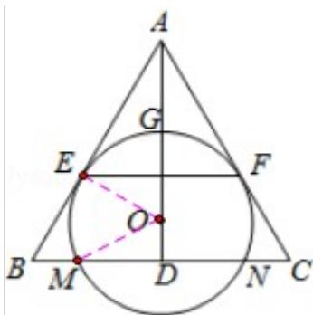

> [!faq]- 2015年全国统一高考数学试卷（理科）（新课标ⅱ）（含解析版）解析
>
> > [!success]- **【答案】** 详见解析
>
> > [!note]- **【分析】**
> > (1) 通过 AD 是 $\angle CAB$ 的角平分线及圆 O 分别与 AB、AC 相切于点 E、F，利
>
> > [!note]- **【解析】**
> > （1）证明：∵△ABC为等腰三角形，AD⊥BC，
> >
> > ∴AD 是 $\angle CAB$ 的角平分线，
> >
> > 又∵圆 O 分别与 AB、AC 相切于点 E、F，
> >
> > $\therefore AE=AF,\quad\therefore AD\perp EF,$
> >
> > ∴EF∥BC;
> > (2) 解：由
> > （1）知 $AE = AF$ ， $AD \perp EF$ ， $\therefore AD$ 是 $EF$ 的垂直平分线，
> >
> > 又∵EF为圆O的弦，∴O在AD上，
> >
> > 连结 OE、OM，则 OE⊥AE，
> >
> > 由 AG 等于圆 O 的半径可得 AO=2OE，
> >
> > $\therefore \angle OAE = 30^{\circ}$ ， $\therefore \triangle ABC$ 与 $\triangle AEF$ 都是等边三角形，
> >
> > $\because AE = 2\sqrt{3}, \therefore AO = 4, OE = 2,$
> >
> > $\because OM = OE = 2, DM = \frac{1}{2} MN = \sqrt{3}, \therefore OD = 1,$
> >
> > $$
> > \therefore A D = 5, \quad A B = \frac {1 0 \sqrt {3}}{3},
> > $$
> >
> > ∴四边形 EBCF 的面积为 $\frac{1}{2} \times \left(\frac{10\sqrt{3}}{3}\right)^{2} \times \frac{\sqrt{3}}{2} - \frac{1}{2} \times (2\sqrt{3})^{2} \times \frac{\sqrt{3}}{2} = \frac{16\sqrt{3}}{3}$ .
> >
> > 
> >
> > 【点评】本题考查空间中线与线之间的位置关系,考查四边形面积的计算,注意解
> >
> > 题方法的积累，属于中档题.
> >
> > ## 选修 4-4：坐标系与参数方程
