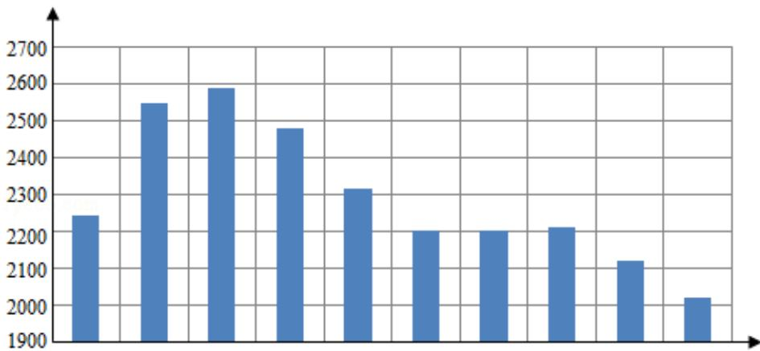

<!-- question-source:start -->
3. （5 分）根据如图给出的 2004 年至 2013 年我国二氧化硫年排放量（单位：万吨）柱形图，以下结论中不正确的是（）

A. 逐年比较，2008年减少二氧化硫排放量的效果最显著  
B. 2007年我国治理二氧化硫排放显现成效  
C. 2006年以来我国二氧化硫年排放量呈减少趋势

D. 2006 年以来我国二氧化硫年排放量与年份正相关
<!-- question-source:end -->

![[高中/真题/按年份分类/2015/2015年全国统一高考数学试卷_理科__新课标ⅱ__含解析版_/选择题/题目/answers/Q00027140A1.md]]
