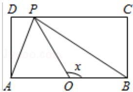
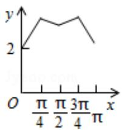
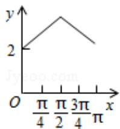
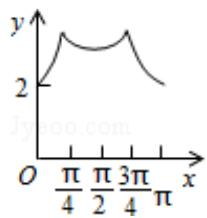
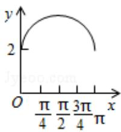

<!-- question-source:start -->
11. 数 $f(x)$ ，则 $y = f(x)$ 的图象大致为（）

A.

C.

B.

D.

$$
\triangle A B M
$$

$$
1 2 0 ^ {\circ}
$$

$$
\sqrt {5}
$$

$$
\sqrt {3}
$$

$$
\sqrt {2}
$$
<!-- question-source:end -->

![[高中/真题/按年份分类/2015/2015年全国统一高考数学试卷_理科__新课标ⅱ__含解析版_/选择题/题目/answers/Q00028382A1.md]]
