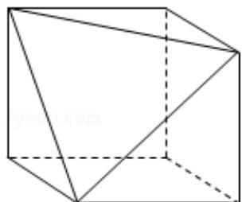

> [!faq]- 2015年全国统一高考数学试卷（理科）（新课标ⅱ）（含解析版）解析
>
> > [!success]- **【答案】** D
>
> > [!note]- **【分析】**
> > 由三视图判断, 正方体被切掉的部分为三棱锥, 把相关数据代入棱锥的体
> > 积公式计算即可.
>
> > [!note]- **【解析】**
> > 分析】由三视图判断, 正方体被切掉的部分为三棱锥, 把相关数据代入棱锥的体
> > 积公式计算即可.
> >
> > 【
> > 解答】解: 设正方体的棱长为 1, 由三视图判断, 正方体被切掉的部分为三棱锥,
> > ∴正方体切掉部分的体积为 $\frac{1}{3}\times\frac{1}{2}\times1\times1\times1=\frac{1}{6}$ ,
> > ∴剩余部分体积为 $1 - \frac{1}{6} = \frac{5}{6}$ ,
> > ∴截去部分体积与剩余部分体积的比值为 $\frac{1}{5}$ .
> >
> > 故选：D.
> >
> > 
> >
> > 【点评】本题考查了由三视图判断几何体的形状，求几何体的体积.
