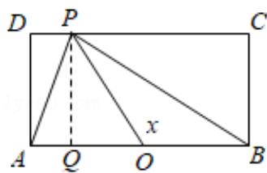
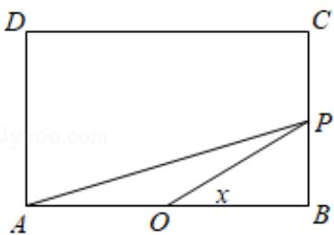

> [!faq]- 2015年全国统一高考数学试卷（理科）（新课标ⅱ）（含解析版）解析
>
> > [!success]- **【答案】** D
>
> > [!note]- **【分析】**
> > 根据函数图象关系，利用排除法进行求解即可.
>
> > [!note]- **【解析】**
> > 解：当 $0 \leq x \leq \frac{\pi}{4}$ 时， $BP = \tan x$ ， $AP = \sqrt{AB^2 + BP^2} = \sqrt{4 + \tan^2 x}$ ，
> >
> > 此时 $f(x) = \sqrt{4 + \tan^2 x} + \tan x, 0 \leq x \leq \frac{\pi}{4}$ ，此时单调递增，
> >
> > $$
> > \frac {\pi}{4} \quad \frac {3 \pi}{4} \quad \frac {\pi}{2}
> > $$
> >
> > 
> >
> > 当 P 在 CD 边上运动时， $\leqslant x \leq$ 且 x = / 时，
> >
> > 如图所示， $\tan \angle POB = \tan (\pi - \angle POQ) = \tan x = -\tan \angle POQ = -\frac{PQ}{OQ} = -\frac{1}{OQ}$ ， $\therefore OQ = -\frac{1}{\tan x}$ ，
> >
> > $\therefore PD = AO - OQ = 1 + \frac{1}{\tan x}, PC = BO + OQ = 1 - \frac{1}{\tan x},$
> >
> > $$
> > \therefore \mathrm{PA} + \mathrm{PB} = \sqrt {\left(1 - \frac {1}{\tan x}\right) ^ {2} + 1} + \sqrt {\left(1 + \frac {1}{\tan x}\right) ^ {2} + 1},
> > $$
> >
> > 当 $x = \frac{\pi}{2}$ 时， $\mathrm{PA} + \mathrm{PB} = 2\sqrt{2}$ ，
> >
> > 当P在AD边上运动时， $\frac{3\pi}{4}\leqslant x\leqslant \pi$ ， $\mathrm{PA + PB = \sqrt{4 + tan^2x} - tanx}$
> >
> > 由对称性可知函数 $f(x)$ 关于 $x = \frac{\pi}{2}$ 对称，
> >
> > 且 $f\left(\frac{\pi}{4}\right) > f\left(\frac{\pi}{2}\right)$ ，且轨迹为非线型，
> >
> > 排除 A, C, D,
> >
> > 故选：B.
> >
> > 
> >
> > 【点评】本题主要考查函数图象的识别和判断，根据条件先求出 $0 \leq x \leq \frac{\pi}{4}$ 时的解析式是解决本题的关键.
> >
> > $$
> > \triangle A B M
> > $$
> >
> > 形，顶角为 $120^{\circ}$ ，则E的离心率为（ ）A. $\sqrt{5}$ B.2 C. $\sqrt{3}$ D. $\sqrt{2}$
> >
> > 【考点】KC：双曲线的性质.
> >
> > 【专题】5D：圆锥曲线的定义、性质与方程.
