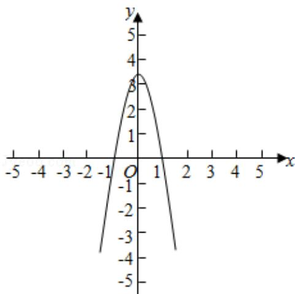

> [!faq]- 2015年全国统一高考数学试卷（理科）（新课标ⅱ）（含解析版）解析
>
> > [!success]- **【答案】** A
>
> > [!note]- **【分析】**
> > 由已知当 x>0 时总有 $xf'(x)-f(x)<0$ 成立，可判断函数 $g(x)=\frac{f(x)}{x}$ 为减函数，由已知 $f(x)$ 是定义在 R 上的奇函数，可证明 $g(x)$ 为 $(-∞,0)∪(0,+∞)$ 上的偶函数，根据函数 $g(x)$ 在 $(0,+∞)$ 上的单调性和奇偶性，模拟 $g(x)$ 的图象，而不等式 $f(x)>0$ 等价于 $x•g(x)>0$ ，数形结合解不等式组即可.
>
> > [!note]- **【解析】**
> > 解：设 $g(x) = \frac{f(x)}{x}$ ，则 $g(x)$ 的导数为： $g'(x) = \frac{x f'(x) - f(x)}{x^2}$ ， $\because$ 当 $x > 0$ 时总有 $x f'(x) < f(x)$ 成立，
> > 即当 $x > 0$ 时， $g'(x)$ 恒小于 0， $\therefore$ 当 $x > 0$ 时，函数 $g(x) = \frac{f(x)}{x}$ 为减函数，
> >
> > 又∵g（-x）= $\frac{f(-x)}{-x}=\frac{-f(x)}{-x}=\frac{f(x)}{x}=g(x)$ ，
> >
> > ∴函数 g（x）为定义域上的偶函数
> >
> > 又∵g（-1）= $\frac{f(-1)}{-1}=0,$
> >
> > ∴函数 g(x) 的图象性质类似如图：
> >
> > 数形结合可得，不等式 $f(x) > 0 \Leftrightarrow x \bullet g(x) > 0$
> >
> > $\Leftrightarrow \left\{ \begin{array}{l} x > 0 \\ g(x) > 0 \end{array} \right.$ 或 $\left\{ \begin{array}{l} x < 0 \\ g(x) < 0 \end{array} \right.$ ,
> >
> > $\Leftrightarrow0<x<1$ 或 x<-1.
> >
> > 故选：A.
> >
> > 
> >
> > 【点评】本题主要考查了利用导数判断函数的单调性，并由函数的奇偶性和单调
> >
> > 性解不等式，属于综合题.
> >
> > ##
> > 二、填空题（共4小题，每小题5分，满分20分）
