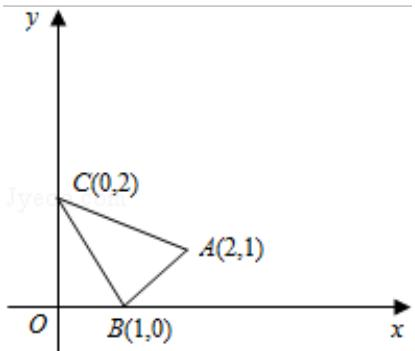

<!-- question-source:start -->
13. (5 分) (2015·北京) 如图, $\triangle ABC$ 及其内部的点组成的集合记为 D, P(x, y) 为 D 中任意一点, 则 $z = 2x + 3y$ 的最大值为 \_\_\_\_.

<!-- question-source:end -->

![[高中/真题/按年份分类/2015/2015年北京高考文科数学试题及答案/填空题/题目/answers/Q00023887A1.md]]
