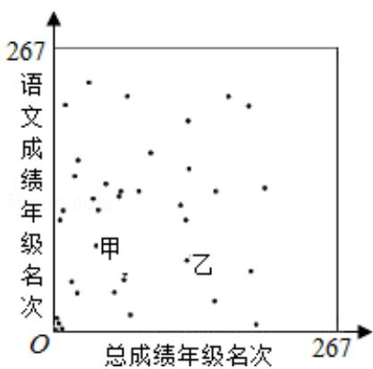
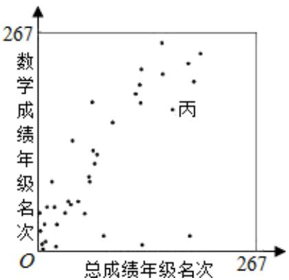

<!-- question-source:start -->
14.（5 分）(2015·北京) 高三年级 267 位学生参加期末考试, 某班 37 位学生的语文成绩, 数学成绩与总成绩在全年级的排名情况如图所示, 甲、乙、丙为该班三位学生.

  
从这次考试成绩看，

① 在甲、乙两人中，其语文成绩名次比其总成绩名次靠前的学生是\_\_\_\_；

② 在语文和数学系两个科目中，丙同学的成绩名次更靠前的科目是\_\_\_\_。

##
三、解答题（共80分）
<!-- question-source:end -->

![[高中/真题/按年份分类/2015/2015年北京高考文科数学试题及答案/填空题/题目/answers/Q00028374A1.md]]
