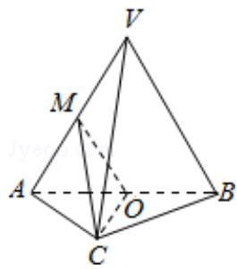

<!-- question-source:start -->
18.（14分）(2015·北京)如图，在三棱锥V-ABC中，平面VAB⊥平面ABC，△VAB为等边三角形，AC⊥BC且 $AC=BC=\sqrt{2}$ ，O，M分别为AB，VA的中点.

(1) 求证: VB∥平面 MOC;

(2) 求证: 平面 MOC⊥平面 VAB

(3) 求三棱锥 V - ABC 的体积.

<!-- question-source:end -->

![[高中/真题/按年份分类/2015/2015年北京高考文科数学试题及答案/解答题/题目/answers/Q00023892A1.md]]
