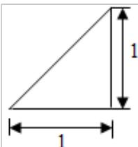
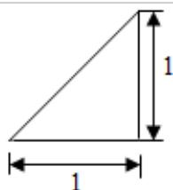
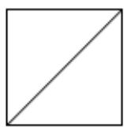

<!-- question-source:start -->
7. （5 分）（2015·北京）某四棱锥的三视图如图所示，该四棱锥最长棱的棱长为（）

正（主）视图

侧（左）视图

俯视图A.1 B. $\sqrt{2}$ C. $\sqrt{3}$ D.2
<!-- question-source:end -->

![[高中/真题/按年份分类/2015/2015年北京高考文科数学试题及答案/选择题/题目/answers/Q00023881A1.md]]
