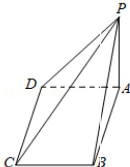

> [!faq]- 2015年北京高考文科数学试题及答案解析
>
> > [!success]- **【答案】** C
>
> > [!note]- **【分析】**
> > 几何体是四棱锥，且四棱锥的一条侧棱与底面垂直，结合直观图求相关几何量的数据，可得
>
> > [!note]- **【解析】**
> > 分析： 几何体是四棱锥，且四棱锥的一条侧棱与底面垂直，结合直观图求相关几何量的数据，可得
> > 答案
> >
> > 解答： 解：由三视图知：几何体是四棱锥，且四棱锥的一条侧棱与
> >
> > 底面垂直，
> > 底面为正方形
> > 如图：
> >
> > 
> >
> > 其中 PA⊥平面
> > ABCD，底面
> > ABCD 为正方形
> > ∴PA=1, AB=1,
> > AD=1,
> > ∴PB= $\sqrt{2}$ , PC= $\sqrt{2+1}=\sqrt{3}$ .
> > PD= $\sqrt{2}$ 该几何体最长棱的棱长为： $\sqrt{3}$ 故选：C.
> > 本题考查了由三视图求几何体的最长棱长问题，根据三视图判断几何体的结构特征是
> > 解答本题的关键
> >
> > 点评：本题考查了由三视图求几何体的最长棱长问题，根据三视图判断几何体的结构特征是
> > 解答本题的关键
