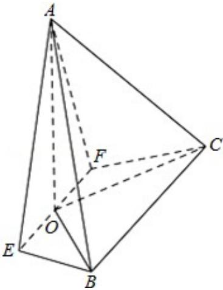

<!-- question-source:start -->
17.（14分）(2015·北京)如图，在四棱锥A-EFCB中， $\triangle$ AEF为等边三角形，平面AEF⊥平面EFCB，EF∥BC，BC=4，EF=2a， $\angle$ EBC= $\angle$ FCB=60°，O为EF的中点.

(Ⅰ) 求证: AO⊥BE.

（Ⅱ）求二面角 F-AE-B 的余弦值；

（III）若 BE⊥平面 AOC，求 a 的值.

<!-- question-source:end -->

![[高中/真题/按年份分类/2015/2015年北京高考理科数学试题及答案/解答题/题目/answers/Q00023113A1.md]]
