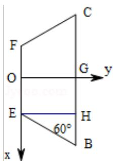
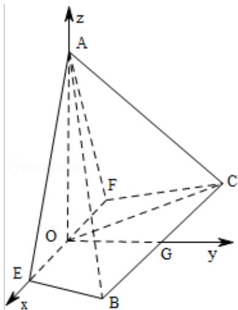

> [!faq]- 2015年北京高考理科数学试题及答案解析
>
> > [!success]- **【答案】** 详见解析
>
> > [!note]- **【分析】**
> > （Ⅰ）根据线面垂直的性质定理即可证明 AO⊥BE.
>
> > [!note]- **【解析】**
> > 证明：（Ⅰ）∵△AEF为等边三角形，O为EF的中点，
> >
> > $\therefore AO \perp EF,$
> >
> > ∵平面 AEF⊥平面 EFCB，AOC平面 AEF，
> >
> > ∴AO⊥平面 EFCB
> >
> > $\therefore AO \perp BE.$
> >
> > （Ⅱ）取 BC 的中点 G，连接 OG，
> >
> > ∵EFCB 是等腰梯形，
> >
> > $\therefore OG\perp EF,$
> >
> > 由（Ⅰ）知 AO⊥平面 EFCB，
> >
> > ∵OG⊂平面EFCB，∴OA⊥OG，
> >
> > 建立如图的空间坐标系，
> >
> > 则 $\mathrm{OE} = \mathrm{a}$ ， $\mathrm{BG} = 2$ ， $\mathrm{GH} = \mathrm{a}$ ， $\mathrm{BH} = 2 - \mathrm{a}$ ， $\mathrm{EH} = \mathrm{BH}\tan 60^{\circ} = \sqrt{3}(2 - \mathrm{a})$
> >
> > 则 E（a，0，0），A（0，0， $\sqrt{3}$ a），B（2， $\sqrt{3}$ （2-a），0），
> >
> > $\overrightarrow{EA} = (-a, 0, \sqrt{3} a), \overrightarrow{BE} = (a - 2, -\sqrt{3}(2 - a), 0)$
> >
> > 设平面 AEB 的法向量为 $\vec{n}=(x,y,z)$ ，
> >
> > 则 $\left\{ \begin{array}{l} \overrightarrow{\mathrm{n}} \cdot \overrightarrow{\mathrm{EA}} = 0 \\ \overrightarrow{\mathrm{n}} \cdot \overrightarrow{\mathrm{BE}} = 0 \end{array} \right.$ ，即 $\left\{ \begin{array}{l} -\mathrm{ax} + \sqrt{3}\mathrm{az} = 0 \\ (\mathrm{a} - 2)\mathrm{x} + \sqrt{3} (\mathrm{a} - 2)\mathrm{y} = 0 \end{array} \right.$ ，
> >
> > 令 $z = 1$ ，则 $x = \sqrt{3}, y = -1$
> >
> > 即 $\vec{\mathbf{n}} = (\sqrt{3}, -1, 1)$
> >
> > 平面 AEF 的法向量为 $\vec{m}=(0,1,0)$ ，
> >
> > 则 $\cos < \vec{m}, \vec{n} > = \frac{\vec{m} \cdot \vec{n}}{|\vec{m}| |\vec{n}|} = -\frac{\sqrt{5}}{5}$
> >
> > 即二面角 F - AE - B 的余弦值为 $-\frac{\sqrt{5}}{5}$ ;
> >
> > （III）若 BE⊥平面 AOC，
> >
> > 则 BE⊥OC,
> >
> > 即 $\overrightarrow{\mathrm{BE}}\cdot \overrightarrow{\mathrm{OC}} = 0$
> >
> > $\because \overrightarrow{BE} = (a - 2, -\sqrt{3}(2 - a), 0), \overrightarrow{OC} = (-2, \sqrt{3}(2 - a), 0)$
> >
> > $$
> > \therefore \overrightarrow {B E} \cdot \overrightarrow {O C} = - 2 (a - 2) - 3 (a - 2) ^ {2} = 0,
> > $$
> >
> > 解得 $a=\frac{4}{3}$ .
> >
> > 
> >
> > 
> >
> > 点评：本题主要考查空间直线和平面垂直的判定以及二面角的求解，建立坐标系利用向量法是解决空间角的常用方法.
