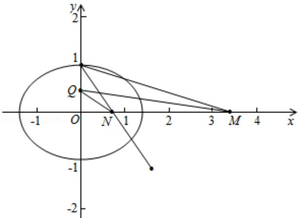

> [!faq]- 2015年北京高考理科数学试题及答案解析
>
> > [!success]- **【答案】** 详见解析
>
> > [!note]- **【分析】**
> > (I) 根据椭圆的几何性质得出 $\left\{\begin{aligned}b&=1\\ \frac{c}{a}&=\frac{\sqrt{2}}{2}\\ a^{2}&=b^{2}+c^{2}\end{aligned}\right.$ 求解即可.
>
> > [!note]- **【解析】**
> > 解：（I）由题意得出 $\left\{ \begin{array}{l} b = 1 \\ \frac{c}{a} = \frac{\sqrt{2}}{2} \\ a^2 = b^2 + c^2 \end{array} \right.$
> >
> > 解得： $a = \sqrt{2}$ ， $b = 1$ ， $c = 1$
> >
> > $$
> > \therefore \frac {\mathrm{x} ^ {2}}{2} + \mathrm{y} ^ {2} = 1,
> > $$
> >
> > ∵P（0，1）和点A（m，n），-1<n<1
> >
> > ∴PA的方程为： $y - 1 = \frac{n - 1}{m} x,\quad y = 0$ 时， $x_{M} = \frac{m}{1 - n}$
> >
> > ∴M ( $\frac{m}{1-n}$ , 0)
> >
> > (II) $\because$ 点B与点A关于x轴对称，点A（m，n）（m≠0） $\therefore$ 点B（m，-n）（m≠0） $\because$ 直线PB交x轴于点N， $\therefore N\left(\frac{m}{1+n},0\right)$
> >
> > 
> >
> > ∵存在点 Q，使得 $\angle OQM = \angle ONQ$ ，Q（0， $y_{Q}$ ）， $\therefore\tan\angle OQM=\tan\angle ONQ,$
> >
> > $\therefore \frac{y_{Q}}{x_{M}} = \frac{x_{N}}{y_{Q}}$ ，即 $y_{Q}^{2} = x_{M} \cdot x_{N}$ ， $\frac{m^{2}}{2} + n^{2} = 1$
> >
> > $$
> > \mathrm{yQ} ^ {2} = \frac {\mathrm{m} ^ {2}}{1 - \mathrm{n} ^ {2}} = 2,
> > $$
> >
> > $\therefore \mathrm{y}_{\mathrm{Q}} = \pm \sqrt{2},$
> >
> > 故 $y$ 轴上存在点 $Q$ ，使得 $\angle OQM = \angle ONQ$ ， $Q(0, \sqrt{2})$ 或 $Q(0, -\sqrt{2})$
> >
> > 点评：本题考查了直线圆锥曲线的方程，位置关系，数形结合的思想的运用，运用代数的方法求解几何问题，难度较大，属于难题.
