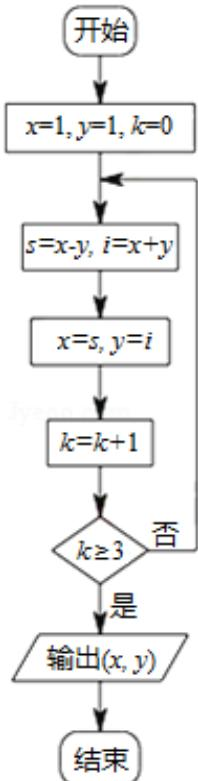

<!-- question-source:start -->
3. （5 分）（2015·北京）执行如图所示的程序框图，输出的结果为（）

A. $(-2, 2)$ B. $(-4, 0)$ C. $(-4, -4)$ D. $(0, -8)$
<!-- question-source:end -->

![[高中/真题/按年份分类/2015/2015年北京高考理科数学试题及答案/选择题/题目/answers/Q00023099A1.md]]
