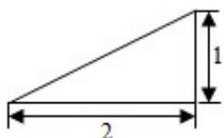
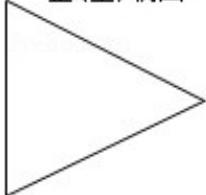
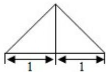

<!-- question-source:start -->
5. （5 分）（2015·北京）某三棱锥的三视图如图所示，则该三棱锥的表面积是（）

正(主)视图  

  
侧(左)视图

俯视图A. $2 + \sqrt{5}$ B. $4 + \sqrt{5}$ C. $2 + 2\sqrt{5}$ D.5
<!-- question-source:end -->

![[高中/真题/按年份分类/2015/2015年北京高考理科数学试题及答案/选择题/题目/answers/Q00023101A1.md]]
