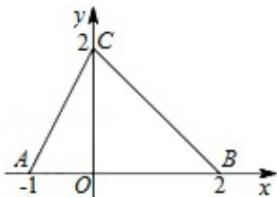

<!-- question-source:start -->
7. (5 分) (2015·北京) 如图, 函数 $f(x)$ 的图象为折线 ACB, 则不等式 $f(x) \geqslant \log_2(x + 1)$ 的解集是 ( )

A. $\{\mathrm{x}|-1<\mathrm{x}\leq 0\}$ B. $\{\mathrm{x}|-1\leq \mathrm{x}\leq 1\}$ C. $\{\mathrm{x}|-1<\mathrm{x}\leq 1\}$ D. $\{\mathrm{x}|-1<\mathrm{x}\leq 2\}$
<!-- question-source:end -->

![[高中/真题/按年份分类/2015/2015年北京高考理科数学试题及答案/选择题/题目/answers/Q00023103A1.md]]
