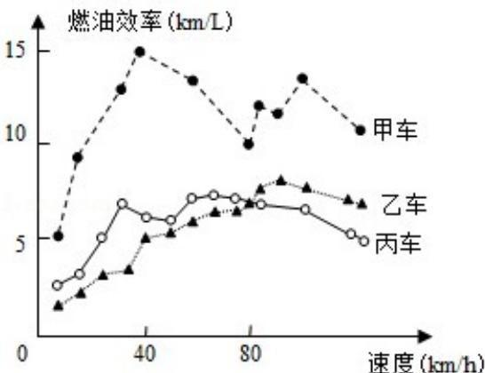

<!-- question-source:start -->
8.（5分）(2015·北京)汽车的“燃油效率”是指汽车每消耗1升汽油行驶的里程，如图描述了甲、乙、丙三辆汽车在不同速度下燃油效率情况，下列叙述中正确的是（）

A. 消耗1升汽油，乙车最多可行驶5千米  
B. 以相同速度行驶相同路程，三辆车中，甲车消耗汽油最多  
C. 甲车以80千米/小时的速度行驶1小时，消耗10升汽油  
D. 某城市机动车最高限速80千米/小时，相同条件下，在该市用丙车比用乙车更省油

##
<!-- question-source:end -->

![[高中/真题/按年份分类/2015/2015年北京高考理科数学试题及答案/选择题/题目/answers/Q00028393A1.md]]
