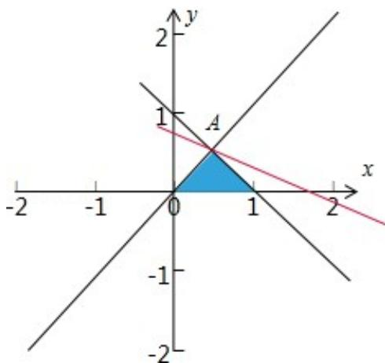

> [!faq]- 2015年北京高考理科数学试题及答案解析
>
> > [!success]- **【答案】** C
>
> > [!note]- **【分析】**
> > 作出题中不等式组表示的平面区域，再将目标函数 $z = x + 2y$ 对应的直线进行平移，即可求出 $z$ 取得最大值.
>
> > [!note]- **【解析】**
> > 解：作出不等式组 $\left\{ \begin{array}{l}x - y\leqslant 0\\ x + y\leqslant 1\\ x\geqslant 0 \end{array} \right.$ 表示的平面区域，得到如图的三角形及其内部阴影部分，由 $\left\{ \begin{array}{l}x - y = 0\\ x + y = 1 \end{array} \right.$ 解得A（ $\frac{1}{2},\frac{1}{2}$ ，目标函数 $z = x + 2y$ ，将直线 $z = x + 2y$ 进行平移，当1经过点A时，目标函数 $z$ 达到最大值 $\therefore z_{\text{最大值}} = \frac{1}{2} +2\times \frac{1}{2} = \frac{3}{2}$ 故选：C.
> >
> > 
> >
> > 点评：本题给出二元一次不等式组，求目标函数 $z = x + 2y$ 的最大值，着重考查了二元一次不等式组表示的平面区域和简单的线性规划等知识，属于基础题.
