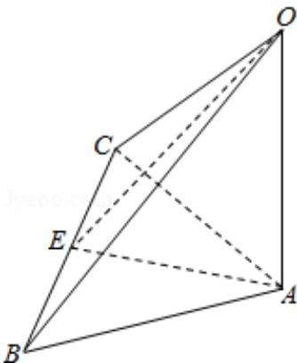

> [!faq]- 2015年北京高考理科数学试题及答案解析
>
> > [!success]- **【答案】** C
>
> > [!note]- **【分析】**
> > 根据三视图可判断直观图为：A⊥面 ABC，AC=AB，E 为 BC 中点，EA=2，EA=EB=1，OA=1，：BC⊥面 AEO，AC= $\sqrt{5}$ ，OE= $\sqrt{5}$ 判断几何体的各个面的特点，计算边长，求解面积.
>
> > [!note]- **【解析】**
> > 分析：根据三视图可判断直观图为：A⊥面 ABC，AC=AB，E 为 BC 中点，EA=2，EA=EB=1，OA=1，：BC⊥面 AEO，AC= $\sqrt{5}$ ，OE= $\sqrt{5}$ 判断几何体的各个面的特点，计算边长，求解面积.
> >
> > 解答：解：根据三视图可判断直观图为：
> > OA⊥面 ABC，AC=AB，E 为 BC 中点，
> >
> > EA=2, EC=EB=1, OA=1,
> >
> > ∴可得 AE⊥BC，BC⊥OA，
> >
> > 运用直线平面的垂直得出：BC⊥面 AEO，AC= $\sqrt{5}$ ，OE= $\sqrt{5}$
> >
> > $$
> > \therefore S _ {\triangle A B C} = \frac {1}{2} \times 2 \times 2 = 2, S _ {\triangle O A C} = S _ {\triangle O A B} = \frac {1}{2} \times \sqrt {5} \times 1 = \frac {\sqrt {5}}{2}.
> > $$
> >
> > $$
> > S _ {\triangle B C O} = \frac {1}{2} \times 2 \times \sqrt {5} = \sqrt {5}.
> > $$
> >
> > 故该三棱锥的表面积是 $2+2\sqrt{5}$ ,
> >
> > 故选：C.
> >
> > 
> >
> > 点评：本题考查了空间几何体的三视图的运用，空间想象能力，计算能力，关键是恢复直观图，得出几何体的性质.
