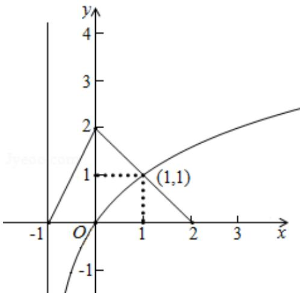

> [!faq]- 2015年北京高考理科数学试题及答案解析
>
> > [!success]- **【答案】** C
>
> > [!note]- **【分析】**
> > 在已知坐标系内作出 $y = \log_2(x + 1)$ 的图象, 利用数形结合得到不等式的解集.
>
> > [!note]- **【解析】**
> > 分析: 在已知坐标系内作出 $y = \log_2(x + 1)$ 的图象, 利用数形结合得到不等式的解集.
> >
> > 解答：解：由已知 $f(x)$ 的图象，在此坐标系内作出 $y = \log_2(x + 1)$ 的图象，如图
> >
> > 
> >
> > 满足不等式 $f(x) \geqslant \log_2(x + 1)$ 的 $x$ 范围是 $-1 < x \leq 1$ ; 所以不等式 $f(x) \geqslant \log_2(x + 1)$ 的解集是 $\{x | -1 < x \leq 1\}$ ; 故选 C.
> >
> > 点评：本题考查了数形结合求不等式的解集；用到了图象的平移.
