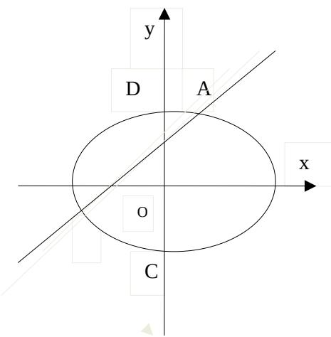

<!-- question-source:start -->
20、（本小题满分13分）

如图，椭圆 E: $\frac{x^{2}}{a^{2}}+\frac{y^{2}}{b^{2}}=1$ （a>b>0）的离心率是 $\frac{\sqrt{2}}{2}$ ，点（0,1）在短轴 CD 上，且 $\overline{PC}\overline{PD}=-1$

(1) 求椭圆 E 的方程;

(2) 设 O 为坐标原点，过点 P 的动直线与椭圆交于 A、B 两点。是否存在常数 $\lambda$ ，使得 $\overline{OA}\overline{OB} + \lambda\overline{PA}\overline{PB}$ 为定值？若存在，求 $\lambda$ 的值；若不存在，请说明理由。

<!-- question-source:end -->

![[高中/真题/按年份分类/2015/2015年四川高考文科数学试卷_word版_和答案/解答题/题目/answers/Q00026489A1.md]]
