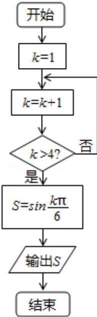

<!-- question-source:start -->
7. 

A $\frac{\sqrt{3}}{2}$ B $\frac{\sqrt{3}}{2}$ C $\frac{1}{2}$ D $\frac{1}{2}$

考点： 程序框图.

专题：图表型；算法和程序框图.
<!-- question-source:end -->

![[高中/真题/按年份分类/2015/2015年四川高考文科数学试卷_word版_和答案/解答题/题目/answers/Q00026492A1.md]]
