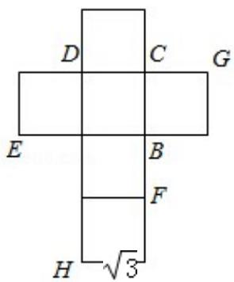
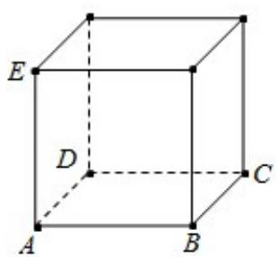

<!-- question-source:start -->
18. （12 分）（2015·四川）一个正方体的平面展开图及该正方体的直观图的示意图如图所示.

$\sqrt{3}$

（Ⅰ）请按字母 F，G，H 标记在正方体相应地顶点处（不需要说明理由）

（II）判断平面 BEG 与平面 ACH 的 ACsinC:√2 说明你的结论.

（III）证明：直线DF⊥平面BEG. AB 2

$$
\frac {A C \sin C}{A B} \cdot \frac {\sqrt {2}}{2}
$$

$$
\frac {1}{\mathrm{与} \sqrt {3 \mathrm{面}}}
$$

考点：直线与平面垂直的判定；平面与√3面之间的位置关系.

专题：空间位置关系与距离.
<!-- question-source:end -->

![[高中/真题/按年份分类/2015/2015年四川高考文科数学试卷_word版_和答案/解答题/题目/answers/Q00026496A1.md]]
