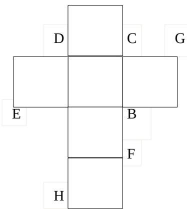
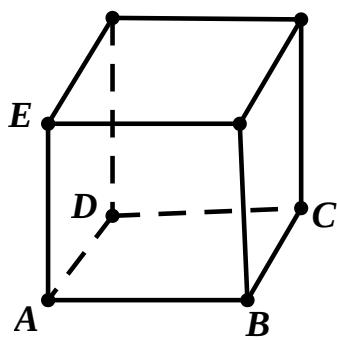

<!-- question-source:start -->
## 18、（本小题满分 12 分）

一个正方体的平面展开图及该正方体的直观图的示意图如图所示。
（1）请将字母 $F, G, H$ 标记在正方体相应的顶点处（不需说明理由）；
（2）判断平面 $BEG$ 与平面 $ACH$ 的位置关系，并证明你的结论；
（3）证明：直线 $DF \perp$ 平面 $BEG$ 。

<!-- question-source:end -->

![[高中/真题/按年份分类/2015/2015年四川高考文科数学试卷_word版_和答案/解答题/题目/answers/Q00029646A1.md]]
