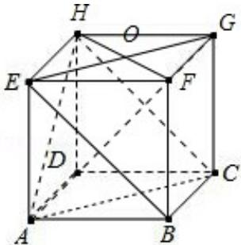

> [!faq]- 2015年四川高考文科数学试卷(word版)和答案解析
>
> > [!success]- **【答案】** 详见解析
>
> > [!note]- **【分析】**
> > （Ⅰ）直接标出点 F，G，H 的位置.
>
> > [!note]- **【解析】**
> > 解：（Ⅰ）点 F，G，H 的位置如图所示.
> >
> > （Ⅱ）平面 BEG∥平面 ACH，证明如下：
> >
> > 又 $\mathrm{FG}\| \mathrm{EH}$ ， $\mathrm{FG} = \mathrm{EH}$
> >
> > ∴BCHE为平行四边形.
> >
> > $$
> > \sqrt {3}
> > $$
> >
> > ∴BE||CH,
> >
> > 又CHC平面ACH，BE∉平面A $\frac{AC\sin C}{AB}\frac{\sqrt{6}\sin60^{\circ}}{3}\frac{\sqrt{2}}{2}$ ∴BE∥平面 ACH,
> >
> > 同理BG||平面ACH，
> >
> > $$
> > \mathrm{BE} \cap \mathrm{BG} = \mathrm{B}
> > $$
> >
> > ∴平面 BEG∥平面 ACH.
> >
> > (Ⅲ) 连接 FH,
> >
> > ∵ABCD - EFGH 为正方体，
> >
> > ∴DH⊥EG,
> >
> > 又∵EG⊂ $^{2}$ 1 EFGH,
> > ∴DH⊥EG, $\sqrt{3}$
> >
> > 又 $EG \perp FH$ ， $EG \cap FH = O$ ，
> >
> > $$
> > \begin{array}{l l} \frac {\tan 4 5 ^ {\circ} + \tan 3 0 ^ {\circ}}{1 - \tan 4 5 ^ {\circ} \tan 3 0 ^ {\circ}} \frac {1 + \frac {\sqrt {3}}{3}}{1 - \frac {\sqrt {3}}{3}} & \sqrt {3} \\ \frac {1}{\sqrt {3}} \quad \sqrt {3} + 1 & \sqrt {3} \end{array}
> > $$
> >
> > ∴EG⊥平面 BFHD，
> >
> > 又 DFC 平面 BFHD，
> >
> > ∴DF⊥EG,
> >
> > 同理DF⊥BG，
> >
> > 又∵EG∩BG=G，
> >
> > ∴DF⊥平面 BEG.
> >
> > 
> >
> > 点评：本题主要考查了简单空间图形的直观图、空间线面平行与垂直的判定与性质等基础知识，考查了空间想象能力和推理论证能力，属于中档题.
