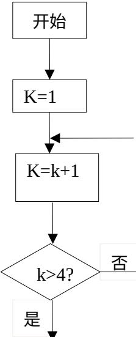

<!-- question-source:start -->
8、某食品的保鲜时间 $y$ （单位：小时）与储藏温度 $x$ （单位：℃）满足函数关系 $y = e^{kx + b}$ （ $e = 2.718...$ 为自然对数的底数， $k, b$ 为常数）。若该食品在 $0^{\circ}\mathrm{C}$ 的保鲜时间是192

小时，在 $22^{\circ}\mathrm{C}$ 的保鲜时间是48小时，则该食品在 $33^{\circ}\mathrm{C}$ 的保鲜时间是(A)16小时 (B)20小时 (C)24小时 (D)28小时

$$
\left\{ \begin{array}{l} 2 x + y \leq 1 0, \\ x + 2 y \leq 1 4, \\ x + y \geq 6, \end{array} \right.
$$
<!-- question-source:end -->

![[高中/真题/按年份分类/2015/2015年四川高考文科数学试卷_word版_和答案/选择题/题目/answers/Q00026482A1.md]]
