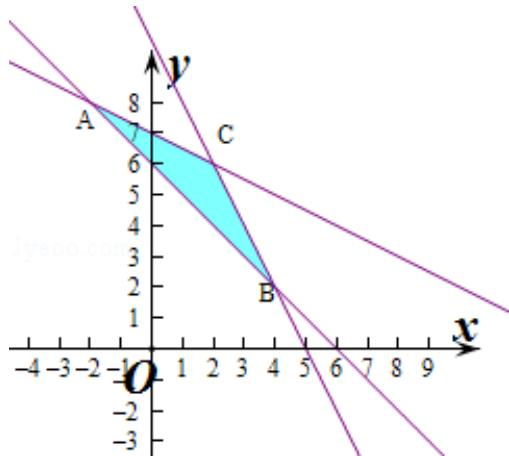

> [!faq]- 2015年四川高考文科数学试卷(word版)和答案解析
>
> > [!success]- **【答案】** 详见解析
>
> > [!note]- **【分析】**
> > 作出不等式组1时应i面区域，利用基本不等式进行求解即可.
>
> > [!note]- **【解析】**
> > 解：作出不等式组；i·i的平面区域如图；
> > 则动点 P 在 BC 上运动时，xy 取得最大值，
> > 此时 $2x+y=10$ 则 $\frac{1}{2} \cdot (2x \cdot y) \leqslant \frac{1}{2} \left( \frac{2x + y}{2} \right)^{2} = \frac{25}{2}$ ，
> > 当且仅当 2x=y=5，
> > 即 x= $\frac{5}{2}$ ，y=5 时，取等号，
> > 故 xy 的最大值为 $\frac{25}{2}$ ，
> > 故选：A
> >
> > 
> >
> > 点评：本题主要考查线性规划以及基本不等式的应用，利用数形结合是解决本题的关键.
