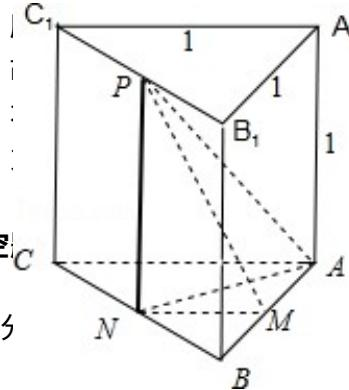

> [!faq]- 2015年四川高考文科数学试卷(word版)和答案解析
>
> > [!success]- **【答案】** 详见解析
>
> > [!note]- **【分析】**
> > 先确定 M 的轨迹是直线 x=3，代入抛物线方程可得 $y=\pm2\sqrt{3}$ ，所以交点与圆心 (5,0) 的距离为 4，即可得出结论.
>
> > [!note]- **【解析】**
> > 分析: 先确定 M 的轨迹是直线 x=3，代入抛物线方程可得 $y=\pm2\sqrt{3}$ ，所以交点与圆心 (5,0) 的距离为 4，即可得出结论.
> >
> > 解答：解：设 A $(x_{1}, y_{1})$ ，B $(x_{2}, y_{2})$ ，M $(x_{0}, y_{0})$ ，则斜率存在时，设斜率为 k，则 $y_{1}^{2}=4x_{1}$ ， $y_{2}^{2}=4x_{2}$ ，利用点差法可得 $ky_{0}=2$ ，
> >
> > 因为直线与圆相切， $\frac{1}{x_{0}-5}=\frac{1}{k}$ ，所以 $x_{0}=3$ ，
> >
> > 即 M 的轨迹是直线 43，
> >
> > 代入抛物线方程可得 $y = \pm 2\sqrt{3}$ ，所 $\frac{1}{3} \times \frac{1}{4} \times \frac{1}{2} \times 1 \times 1 \times 1$ 的 $\frac{1}{24}$ 离为4，
> >
> > 所以 $2 < r < 1$ ，直线1有2条；
> >
> > 斜率不存在24直线1有2条；
> >
> > 点评：
> >
> > ##
> > 二、填空
> >
> > 
> >
> > 的位置关系，考查点差法，考查学生
> > 分析解决问题的能
