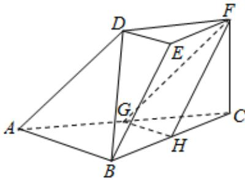

<!-- question-source:start -->
17.如图，在三棱台DEF-ABC中， $\mathrm{AB} = 2\mathrm{DE}$ ，G，H分别为AC，BC的中点。

(Ⅰ) 求证: BC//平面 FGH;

（II）若 $\mathrm{CF} \perp$ 平面ABC， $\mathrm{AB} \perp \mathrm{BC}$ ， $\mathrm{CF} = \mathrm{DE}$ ， $\angle \mathrm{BAC} = 45^{\circ}$ ，求平面FGH与平面ACFD所成的角（锐角）的大小。
<!-- question-source:end -->

![[高中/真题/按年份分类/2015/2015年山东省高考数学试卷_理科_word版试卷及解析/选择题/题目/answers/Q00025791A1.md]]
