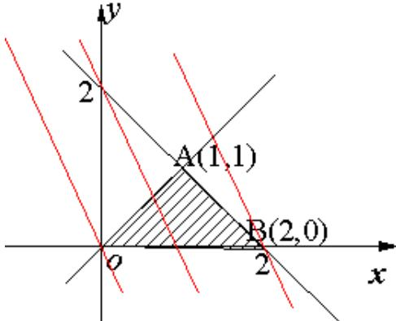

> [!faq]- 2015年山东省高考数学试卷(理科)word版试卷及解析解析
>
> > [!success]- **【答案】** B
>
> > [!note]- **【分析】**
> > 本题未单列分析。
>
> > [!note]- **【解析】**
> > 过程：
> >
> > 作出可行域如图
> >
> > 
> >
> > 若 $z = ax + y$ 的最大值为4，则最优解可能为 $A(1,1)$ 或 $B(2,0)$
> >
> > 经检验 $A(1,1)$ 不是最优解， $B(2,0)$ 是最优解，此时 $a = 2$
