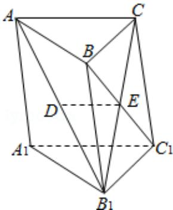

<!-- question-source:start -->
16.（14分）（2015·江苏）如图，在直三棱柱 $\mathrm{ABC - A_1B_1C_1}$ 中，已知AC⊥BC， $\mathrm{BC = CC_1}$ ，设 $\mathrm{AB}_1$ 的中点为D， $\mathrm{B_1C\cap BC_1 = E}$

求证：

(1) DE∥平面 AA₁C₁C;

(2) $BC_{1} \perp AB_{1}$ .

<!-- question-source:end -->

![[高中/真题/按年份分类/2015/2015年江苏高考数学试题及答案/填空题/题目/answers/Q00024089A1.md]]
